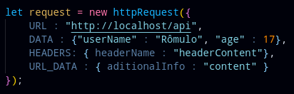
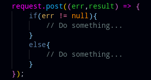
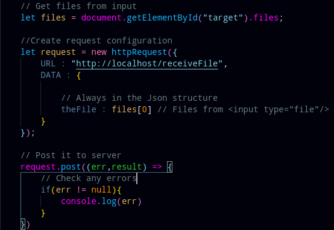

# HttpLibrary

## What is

Http library is an easy way to make HTTP request from popular browser, you only need to configure your request through an Json Object, and then choose you method of request.

## Creators 
- Rômulo Peres de Moraes

## How to use
The libray is an single file, that you just need download and import in a script tag, or through the link of raw file on Github.

This is a basic configuration of the module
 

To make a request with your protocol just do
 

The request method receive just an callback that will the executed when the request be completed

## Error variable
Sometimes a error can the throwed, then you can handle it in the err variable, you must check if it is null everytime that you made a request.

## Result variable
The result is the variable that is filled when the request was made with sucess, and your structure is:

- headers : Contain the headers of response
- status : Status code of the operation
- text : The text returned from server

## Cheat sheet
This is all constants that will need remember when write some http request with this library:

- HEADERS - Define the headers in request configuration, only accepts Json Object

- URL - The server url that will make the connection

- URL_DATA - This is a macro, more used in GET requests, the object will be trasformed in URL params like "?name=Rose&age=17", only accepts Json Objects.

- DATA - The data that will me sent to the target server, only accept Json Object

- Err - Variable that holds some request error

- Result - Variable that holds request results

## Exceptions
Some library's execeptions can be throwed when you make bad use of the library, they are:

- notObjectReceivedException - When you don't passed an Json Object as constructor configuration

- headersWasNotObject - When you don't passed an Json Object to headers configuration

- targetUrlWasNotAnString - When you don't passed an String to URL configuration

- dataArgumentWasNotJsonObject - When you don't passed an Json Object to data configuration

- urlDataArgumentWasNotJsonObject - When you don't passed an Json Object to url data configuration

- dataArgumentInGetRequest - When you try GET request after put some data configuration in the constructor

## Available protocols

- GET

- POST

- PUT

- DELETE

## Notes
Never forget: in javascript an assync operation that execute a callback can't change values outside the callback's scope.

## Updates

Update 1.0.1:

    Files can be uploaded in this version, look the script below:
    

